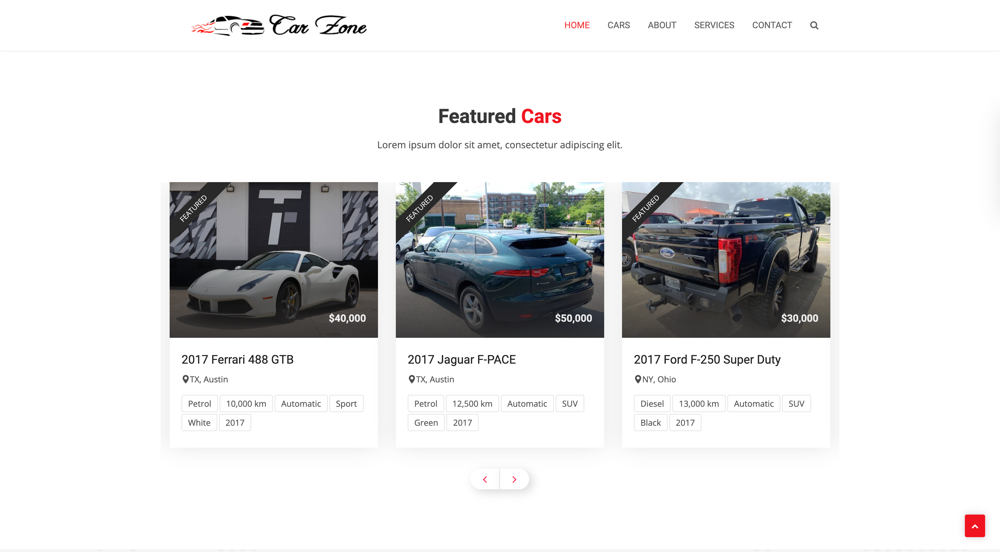
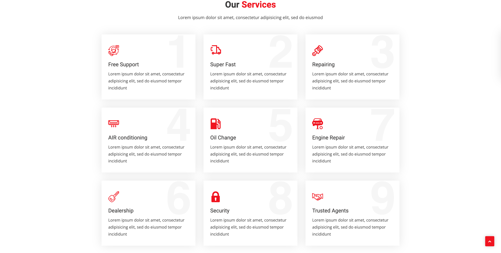

# About this project:
This project was created many months ago when I followed this Udemy course https://www.udemy.com/course/python-django-real-project-for-freshers-freelancers/. 

I made an effort not to simply copy-paste everything the instructor demonstrated but instead aimed to enhance the website's flexibility. While this course targets beginners and does not cover many advanced topics except deployment, I chose to professionalize it by using a .env file, dividing Django settings into base, dev, and prod, among other improvements. The key distinction between the course and my project lies in flexibility, particularly in how you can add various attributes and features to cars.

I've decided to refactor it slightly and share it here, as it is straightforward and can be a useful resource for novice developers. It may inspire them to explore the project's contents, understand how it works, and consider potential additions. Feel free to use it as you wish, try to refactor or improve it!

# Screenshots

Hero/Home page

Cars page

About us page

Services page

Contact us page

Admin panel

